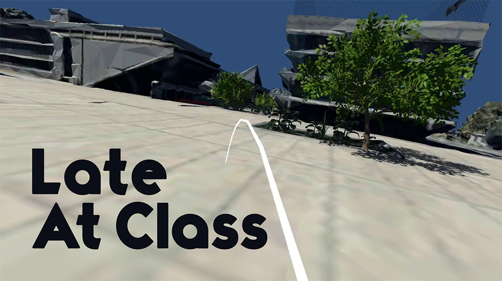

# LateAtClass



## Getting Started

These instructions will get you a copy of the project up and running on your local machine for development purpose.

### Prerequisites

Things you need to install the project :

- [Unity](https://unity.com/fr/download)

### Installing

Here are some instructions on how to get the development env running.

First, clone this repository with the following command :

```bash
git clone https://github.com/skyreymz/LateAtClass.git
```

## Développement :fr:

<!--
Edit the path to the Pico library ("com.unity.xr.picoxr" fields) in the `Packages/packages-lock.json` and `Packages/manifest.json` files.
-->


1) Récupérer le projet vierge
	- Ouvrez le projet via Unity Hub

2) Installer le PICO SDK pour développer sur Unity ([documentation du PICO](https://sdk.picovr.com/docs/UnityXRSDK/en/index.html))
	- Téléchargez le SDK : https://developer.pico-interactive.com/sdk => Device : G2 4k Series => Download (Pico XR_Platform_SDK-1.2.5_B81) **EDIT: ce dossier a finalement été versionné dans `/Packages` !**
	- Décompressez l'archive
	- Sur Unity : Importez le SDK par le menu _Windows > Package Manager > + > Add package from disk_. Sélectionnez le fichier package.json
	- Il est possible qu'une fenêtre PXR SDK setting s’ouvre. Dans ce cas, décochez le User Entitlement Check mais laissez les autres paramètres par défaut (dont l’orientation de l’appli).
	- _Edit > Project Settings > XR Plug-in Management_. Cliquez sur l'onglet Android puis cochez la case « PicoXR »
	A ce stade la librairie PICO est installée sur votre projet Unity. Vous devriez voir un nouveau menu « PXR_SDK » dans la barre de tâche Unity. De plus, dans la fenêtre Project de Unity, le dossier Assets contient maintenant un dossier « XR » ou « PICOXR plugin ».

3) Mettre API level à jour
	- Sur Unity : _Edit > Project settings > Player_. Cliquez sur l'onglet _Android > Other Settings > Identification > Minimum API Level > Android 8.0 'Oreo' (API level 26)_

4) Tester le projet
	- Sur Unity : _File > Build Settings > Add Open Scenes_. Sélectionnez les scènes "Scenes/PlateauScene" et "Scenes/PoPS" doivent être séléctionnées et organisées dans cet ordre.
	- Choisissez la plateforme _Android > Switch Platform_ puis :
		- Build en tant qu'apk
		- Ajouter l'apk dans le pico : G2 4K S\Internal shared storage\Download
			- OU
		- Sélectionnez le Pico dans _Run device_ puis _Build And Run_

### Used assets

- [Gist Level Designer](https://assetstore.unity.com/packages/tools/level-design/gist-level-designer-177276)
- [Escalator Pro](https://assetstore.unity.com/packages/tools/animation/escalatorpro-135432)
- [VR Cinema](https://assetstore.unity.com/packages/3d/props/interior/vr-cinema-for-mobile-150120)
- [Urban American Assets]()
- [Numena]()
- ...

<!--

### Tutoriel pour repartir de 0

1) Récupérer le projet vierge (étapes provenant du site https://learn.unity.com/course/create-with-vr?uv=2020.3 )
	- Téléchargez le package [Create-with-VR_2020LTS.zip](https://connect-prd-cdn.unity.com/20210402/8a67971c-e957-4844-9964-8445a85103e8/Create-with-VR_2020LTS.zip?_ga=2.128504012.1795054087.1639555843-1656829093.1639409693)
	- Récupérez et décompressez le package
	- Vous pouvez renommer le projet
	- Ajoutez le comme un nouveau projet dans le Unity Hub
	- Ouvrez le projet via Unity Hub


2) Installer le PICO SDK pour développer sur Unity ([documentation du PICO](https://sdk.picovr.com/docs/UnityXRSDK/en/index.html))
	- Téléchargez le SDK : https://developer.pico-interactive.com/sdk => Device : G2 4k Series => Download (Pico XR_Platform_SDK-1.2.5_B81)
	- Décompressez l'archive
	- Sur Unity : Importez le SDK par le menu _Windows > Package Manager > + > Add package from disk_. Sélectionnez le fichier package.json
	- Il est possible qu'une fenêtre PXR SDK setting s’ouvre. Dans ce cas, décochez le User Entitlement Check mais laissez les autres paramètres par défaut (dont l’orientation de l’appli).
	- _Edit > Project Settings > XR Plug-in Management_. Cliquez sur l'onglet Android puis cochez la case « PicoXR »
	A ce stade la librairie PICO est installée sur votre projet Unity. Vous devriez voir un nouveau menu « PXR_SDK » dans la barre de tâche Unity. De plus, dans la fenêtre Project de Unity, le dossier Assets contient maintenant un dossier « XR » ou « PICOXR plugin ».

3) Mettre API level à jour
	- Sur Unity : _Edit > Project settings > Player_. Cliquez sur l'onglet _Android > Other Settings > Identification > Minimum API Level > Android 8.0 'Oreo' (API level 26)_

4) Tester le projet
	- Sur Unity : _File > Build Settings > Add Open Scenes_. Sélectionnez la scène "Scenes/Create_with_VR_Starter_Scene"
	- Choisissez la plateforme _Android > Switch Platform_ puis :
		- Build en tant qu'apk
		- Ajouter l'apk dans le pico : G2 4K S\Internal shared storage\Download
			- OU
		- Sélectionnez le Pico dans _Run device_ puis _Build And Run_

## Exporter le projet en tant que package (.unitypackage) :
Sur Unity : _Assets > Export package > All_

## Importer le projet en tant que package (.unitypackage) :
Sur Unity : _Assets > Import package > Custom package_

-->

### Revision history

#### LateAtClass v0.1

- Player VR movement
- "Plateau" scene:
	- visual and "acoustic" environment
	- basketball interactions
	- smartphone interactions
	- "Lieu de Vie" teleporters
- "PoPS" scene:
	- school interior environment
	- livecam phone
- Switch between scenes

---

### Built with


